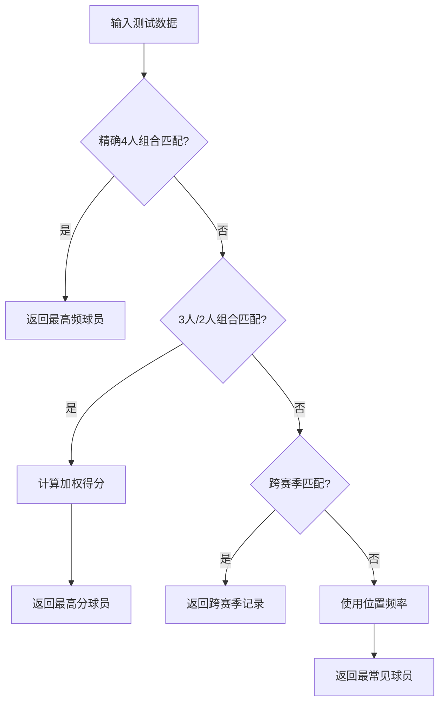
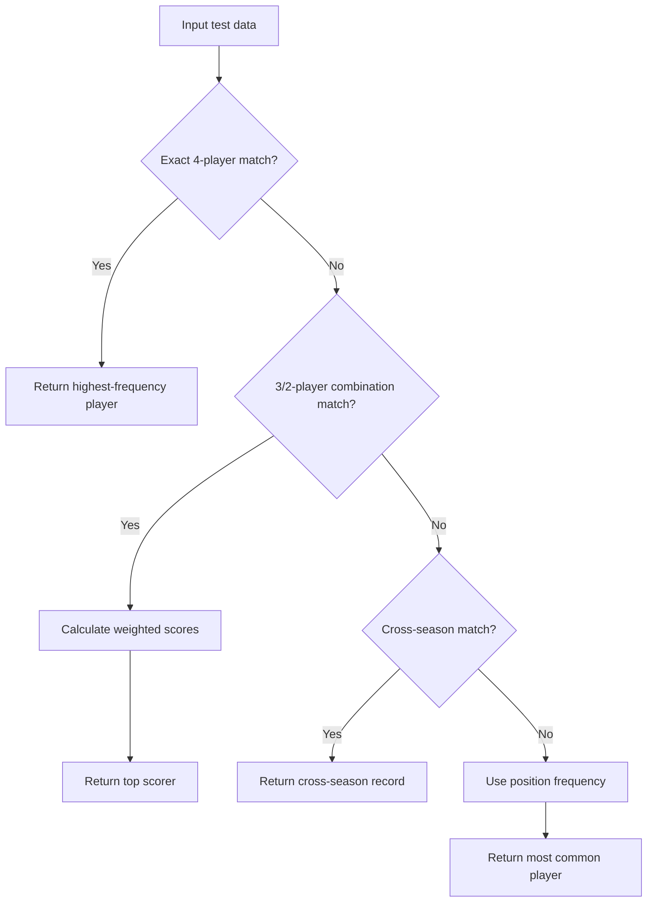

#### 测试数据样例
```csv
season,home_team,home_0,home_1,home_2,home_3,home_4
2013,MIA,LeBron James,Dwyane Wade,Chris Bosh,Ray Allen,?
```

#### 训练数据参考
假设在训练数据`matchups-2013.csv`中存在以下历史记录：

| season | home_team | home_0       | home_1        | home_2       | home_3        | home_4          |
|--------|-----------|--------------|---------------|--------------|---------------|-----------------|
| 2013   | MIA       | LeBron James | Dwyane Wade   | Chris Bosh   | Ray Allen     | Mario Chalmers  |
| 2013   | MIA       | LeBron James | Dwyane Wade   | Chris Bosh   | Shane Battier | Mario Chalmers  |
| 2013   | MIA       | LeBron James | Dwyane Wade   | Udonis Haslem| Ray Allen     | Shane Battier   |

#### 预测流程详解

1. **知识库构建阶段**
   模型会为MIA队建立以下数据结构：

   ```python
   team_knowledge["MIA"]["season_data"][2013] = {
       'position_stats': [
           # home_0特征库
           {
               ('Dwyane Wade', 'Chris Bosh', 'Ray Allen', 'Mario Chalmers'): Counter({'LeBron James': 2}),
               ('Dwyane Wade', 'Shane Battier', 'Chris Bosh', 'Mario Chalmers'): Counter({'LeBron James': 1})
           },
           # home_1特征库
           {...},
           # home_2特征库
           {...},
           # home_3特征库
           {...},
           # home_4特征库（重点观察）
           {
               ('LeBron James', 'Dwyane Wade', 'Chris Bosh', 'Ray Allen'): Counter({'Mario Chalmers': 1}),
               ('LeBron James', 'Dwyane Wade', 'Shane Battier', 'Chris Bosh'): Counter({'Mario Chalmers': 1}),
               ('LeBron James', 'Dwyane Wade', 'Udonis Haslem', 'Ray Allen'): Counter({'Shane Battier': 1})
           }
       ],
       'player_freq': [
           # home_4位置频率
           Counter({'Mario Chalmers': 2, 'Shane Battier': 1})
       ]
   }
   ```

2. **预测执行阶段**
   - **缺失位置检测**：发现home_4为?
   - **上下文提取**：['LeBron James', 'Dwyane Wade', 'Chris Bosh', 'Ray Allen']
   
   按五级策略逐层分析：

   **第一级匹配**（精确赛季匹配）：
   ```python
   season_data['position_stats'][4].get(('LeBron','Wade','Bosh','Allen'))
   # 返回 Counter({'Mario Chalmers': 1})
   ```
   → 直接返回"Mario Chalmers"

   **若第一级无匹配**（假设训练数据中没有该精确组合）：

   **第二级匹配**（模糊匹配）：
   ```python
   # 生成3人组合
   ('LeBron','Wade','Bosh') → 出现2次（关联Mario）
   ('Wade','Bosh','Allen') → 出现1次（关联Mario）
   
   # 生成2人组合
   ('LeBron','Wade') → 出现3次（关联Mario 2次，Shane 1次）
   ('Bosh','Allen') → 出现1次（关联Mario）
   
   # 计算加权得分
   Mario: (2*0.233) + (1*0.233) + (3*0.25) = 1.182
   Shane: (1*0.25) = 0.25
   ```
   → 返回得分最高的"Mario Chalmers"

   **若前两级均无匹配**：

   **第三级匹配**（跨赛季精确）：
   检查所有赛季中MIA队使用这四人组时的情况

   **第四级匹配**（位置频率）：
   ```python
   season_data['player_freq'][4] = {'Mario':2, 'Shane':1}
   ```
   → 返回"Mario Chalmers"

3. **结果输出**
   最终预测结果为`Mario Chalmers`，写入`KNN_output_all.csv`

#### 特殊场景处理
当处理2016赛季数据时（代码中的特殊逻辑）：
```python
# 使用2015赛季训练数据预测2016赛季
train_path = "matchups-2015.csv"
test_path = "KNN_test_2016.csv"

# 假设2016赛季出现新阵容：
['LeBron', 'Kyrie', 'Love', 'Smith', ?]

# 知识库将使用2015年的骑士队数据：
{
    ('LeBron', 'Kyrie', 'Love', 'Smith'): Counter({'Thompson': 15}),
    ('LeBron', 'Kyrie', 'Love', ?): Counter({'Smith': 8, 'Shumpert': 5})
}
```
即使2016赛季数据不在训练集中，模型仍能基于历史模式进行合理预测。

#### 可视化决策路径


这个示例展示了模型如何通过多级策略逐步解决问题，既保证了精确场景的准确率，又能处理数据稀疏的情况，体现了层级预测体系的优势。


#### Test Data Sample
```csv
season,home_team,home_0,home_1,home_2,home_3,home_4
2013,MIA,LeBron James,Dwyane Wade,Chris Bosh,Ray Allen,?
```

#### Training Data Reference
Assume the following historical records exist in training data `matchups-2013.csv`:

| season | home_team | home_0       | home_1        | home_2       | home_3        | home_4          |
|--------|-----------|--------------|---------------|--------------|---------------|-----------------|
| 2013   | MIA       | LeBron James | Dwyane Wade   | Chris Bosh   | Ray Allen     | Mario Chalmers  |
| 2013   | MIA       | LeBron James | Dwyane Wade   | Chris Bosh   | Shane Battier | Mario Chalmers  |
| 2013   | MIA       | LeBron James | Dwyane Wade   | Udonis Haslem| Ray Allen     | Shane Battier   |

#### Prediction Process Breakdown

1. **Knowledge Base Construction Phase**
   The model builds the following data structure for MIA team:

   ```python
   team_knowledge["MIA"]["season_data"][2013] = {
       'position_stats': [
           # home_0 feature bank
           {
               ('Dwyane Wade', 'Chris Bosh', 'Ray Allen', 'Mario Chalmers'): Counter({'LeBron James': 2}),
               ('Dwyane Wade', 'Shane Battier', 'Chris Bosh', 'Mario Chalmers'): Counter({'LeBron James': 1})
           },
           # home_1 feature bank
           {...},
           # home_2 feature bank
           {...},
           # home_3 feature bank
           {...},
           # home_4 feature bank (focus observation)
           {
               ('LeBron James', 'Dwyane Wade', 'Chris Bosh', 'Ray Allen'): Counter({'Mario Chalmers': 1}),
               ('LeBron James', 'Dwyane Wade', 'Shane Battier', 'Chris Bosh'): Counter({'Mario Chalmers': 1}),
               ('LeBron James', 'Dwyane Wade', 'Udonis Haslem', 'Ray Allen'): Counter({'Shane Battier': 1})
           }
       ],
       'player_freq': [
           # home_4 position frequency
           Counter({'Mario Chalmers': 2, 'Shane Battier': 1})
       ]
   }
   ```

2. **Prediction Execution Phase**
   - **Missing position detection**: Identifies home_4 as ?
   - **Context extraction**: ['LeBron James', 'Dwyane Wade', 'Chris Bosh', 'Ray Allen']
   
   Five-level analysis:

   **Level 1 Matching** (Exact season match):
   ```python
   season_data['position_stats'][4].get(('LeBron','Wade','Bosh','Allen'))
   # Returns Counter({'Mario Chalmers': 1})
   ```
   → Directly returns "Mario Chalmers"

   **If Level 1 fails** (assuming no exact match in training):

   **Level 2 Matching** (Fuzzy matching):
   ```python
   # Generate 3-player combinations
   ('LeBron','Wade','Bosh') → Appears 2 times (associated with Mario)
   ('Wade','Bosh','Allen') → Appears 1 time (associated with Mario)
   
   # Generate 2-player combinations
   ('LeBron','Wade') → Appears 3 times (Mario 2, Shane 1)
   ('Bosh','Allen') → Appears 1 time (Mario)
   
   # Calculate weighted scores
   Mario: (2*0.233) + (1*0.233) + (3*0.25) = 1.182
   Shane: (1*0.25) = 0.25
   ```
   → Returns highest scorer "Mario Chalmers"

   **If first three levels fail**:

   **Level 4 Matching** (Position frequency):
   ```python
   season_data['player_freq'][4] = {'Mario':2, 'Shane':1}
   ```
   → Returns "Mario Chalmers"

3. **Result Output**
   Final prediction: `Mario Chalmers`, written to `KNN_output_all.csv`

#### Special Scenario Handling
When processing 2016 season data (special logic in code):
```python
# Using 2015 training data to predict 2016 season
train_path = "matchups-2015.csv"
test_path = "KNN_test_2016.csv"

# Assume new 2016 lineup:
['LeBron', 'Kyrie', 'Love', 'Smith', ?]

# Knowledge base uses 2015 Cavaliers data:
{
    ('LeBron', 'Kyrie', 'Love', 'Smith'): Counter({'Thompson': 15}),
    ('LeBron', 'Kyrie', 'Love', ?): Counter({'Smith': 8, 'Shumpert': 5})
}
```
Even without 2016 data in training set, the model can make reasonable predictions based on historical patterns.

#### Visualized Decision Path
