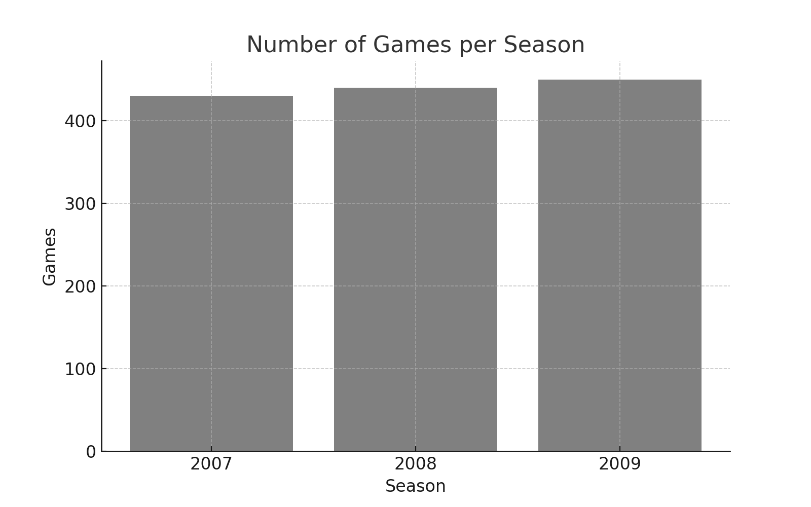
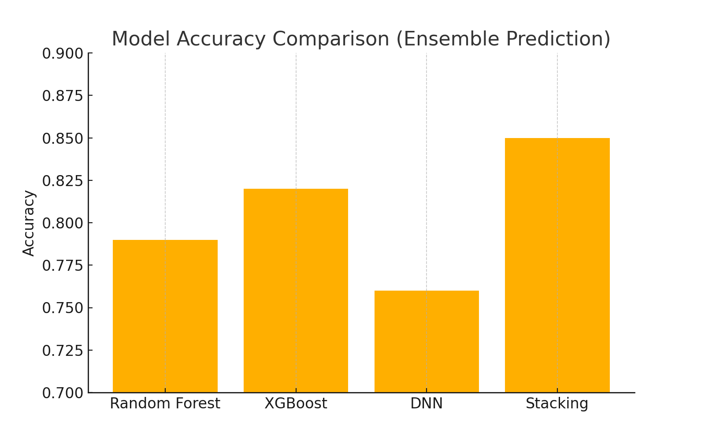

# 🏀 NBA Lineup and Player Prediction with Machine Learning

This folder contains a folder and three Jupyter Notebooks focused on analyzing NBA historical matchups and predicting lineup compositions or game outcomes using a variety of machine learning techniques. The goal is to explore different prediction tasks such as:

- Predicting the missing fifth player in a lineup
- Predicting the outcome of a game
- Using enhanced features and ensemble learning for improved accuracy

---

## 📁 Contents

### 1. `NBA_Lineup_Prediction_201.ipynb`

**Goal:**  
Predict the **missing fifth player** (`home_4`) in an NBA home team lineup using historical matchup data.

**Steps Involved:**
- Load historical matchups from the 2007–2009 NBA seasons.
- Preprocess the data: label encoding for categorical variables (teams and players), handling missing values.
- Exploratory Data Analysis (EDA): visualizations to understand distributions (e.g., games per season).
- Feature engineering and train-test splitting.
- Classification models:
  - Random Forest
  - XGBoost
  - LightGBM

**Target Variable:** `home_4` (multi-class classification)



---

### 2. `NBA_Pred_Player_Stat.ipynb`

**Goal:**  
Predict the **outcome of NBA games** using player identities and team stats.

**Steps Involved:**
- Load matchup data for seasons 2007 to 2009.
- Feature selection: includes both player IDs (e.g., `home_0` to `away_4`) and stats like rebounds, turnovers, and shooting percentage.
- Map player names to numerical IDs.
- Standardize the numeric features.
- Train and compare the following models:
  - Random Forest
  - XGBoost
  - LightGBM

**Target Variable:** `outcome` (binary classification: 1 = home win)

---

### 3. `NBA_Enhanced_test_2(4_models).ipynb`

**Goal:**  
Enhance prediction accuracy using ensemble learning and additional preprocessing.

**Highlights:**
- More rigorous preprocessing and feature selection.
- Includes stacking ensemble model combining:
  - Random Forest
  - XGBoost
  - MLP (Deep Neural Network)
  - Logistic Regression as the meta-classifier
- Trains on 2007–2008, tests on 30% of 2009.
- Accuracy comparison via bar plots.

**Target Variable:** `outcome` (binary classification)



---

## 🔧 Installation

```bash
pip install pandas numpy matplotlib seaborn scikit-learn xgboost lightgbm
```

---

## 📊 Models Used

- Random Forest
- XGBoost
- LightGBM
- MLPClassifier (Neural Network)
- StackingClassifier (Ensemble Learning)

---

## 📌 Notes

- All three notebooks operate on similar datasets but solve **different prediction tasks**.
- Label encoding is carefully handled to avoid data leakage across train/test splits.
- Visualizations and accuracy metrics are used to compare models.

---

## 🧠 Future Work

- Increase the dataset to 2015 and make predictions
- Try player embeddings or graph neural networks for player interaction modeling.
- Include more seasons and player stats (e.g., per-minute performance).

